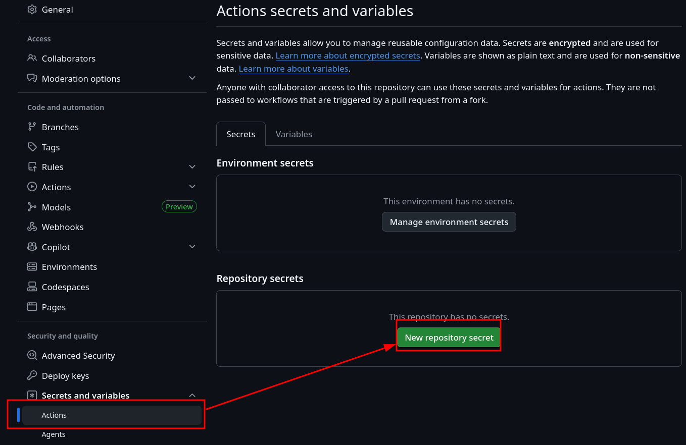
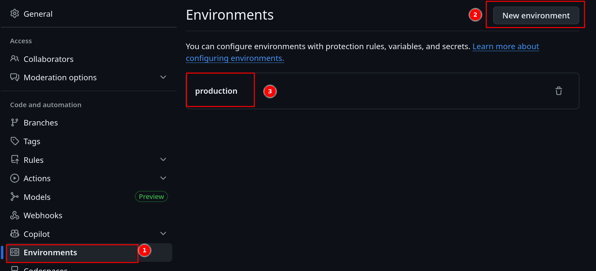
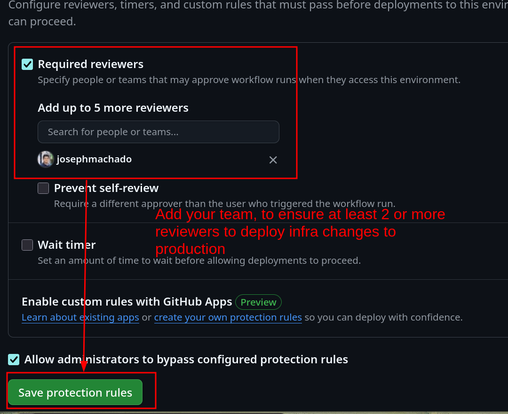

* [README](#readme)
    * [Setup](#setup)
        * [Prerequisites](#prerequisites)
        * [Bootstrap](#bootstrap)
        * [Grant GitHub Access Permission to Deploy to AWS](#grant-github-access-permission-to-deploy-to-aws)
        * [Create a GitHub Environment](#create-a-github-environment)
    * [CI checks](#ci-checks)
    * [Destroy](#destroy)

# README 

Code for the blog: [](https://www.startdataengineering.com/post/infrastructure-cicd-data-engineering/)

## Setup 

### Prerequisites 

1. [AWS & Terraform setup](https://github.com/josephmachado/iac-for-data-engineering-terraform-#prerequisites)
2. [GitHub Account](https://github.com/)

### Bootstrap 

We need to create our state S3 backend and ODIC (for GitHub Actions to deploy to AWS). We have them defined at `./terraform/bootstrap/main.tf`.

Apply them as shown below

```bash 
terraform -chdir=terraform/bootstrap init
terraform -chdir=terraform/bootstrap apply
terraform -chdir=terraform/bootstrap output
# you will see your S3 backend and AWS ARN
```

### Grant GitHub Access Permission to Deploy to AWS 

Create a repo secret and call it `AWS_ROLE_ARN`. The value must be the output from the `bootstrap output` command in the [bootstrap](./README.md#bootstrap) section. 



> [!NOTE]
> When copy-pasting the ARN, do not copy the quotes.

### Create a GitHub Environment 

We use GitHub environment to force manual review. Create this by going to `settings -> environment` in this repo.



Add a review rule requiring atleast one manual review.



## CI checks 

Our CI process checks `.tf` file formats, but does not fix it. Make sure to run the below command before you push your changes to your PR/branch.

```bash 
terraform -chdir=terraform fmt -recursive
```

## Destroy

After you are done, do not forget to destroy all the resources. We have a handy script to do that for you.

```bash
./tear-down.sh
```

